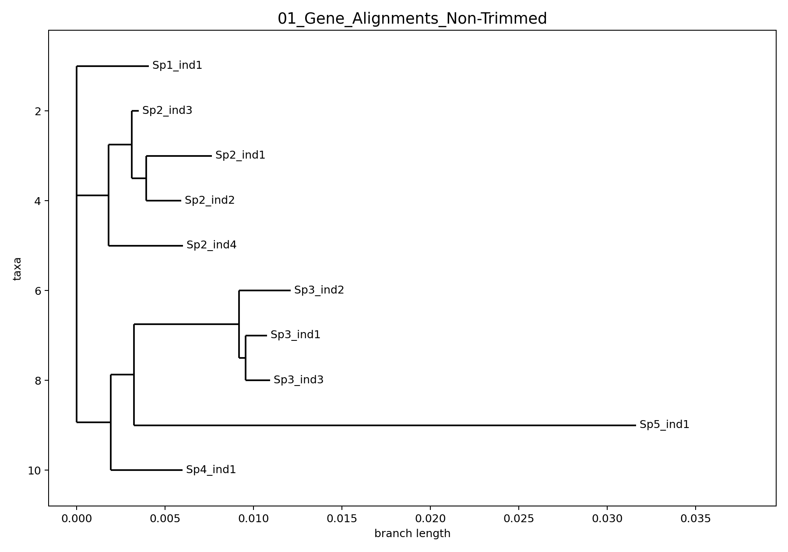
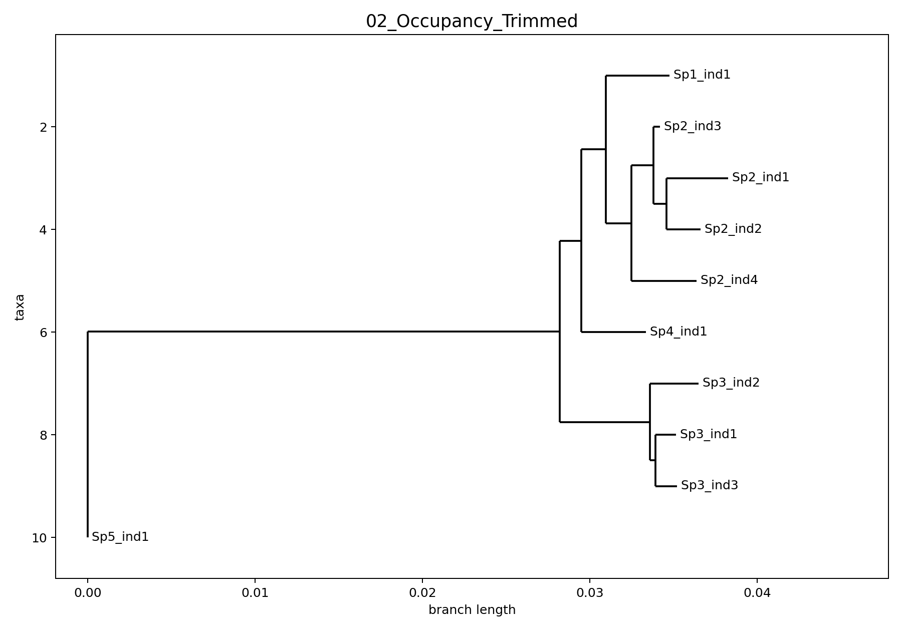
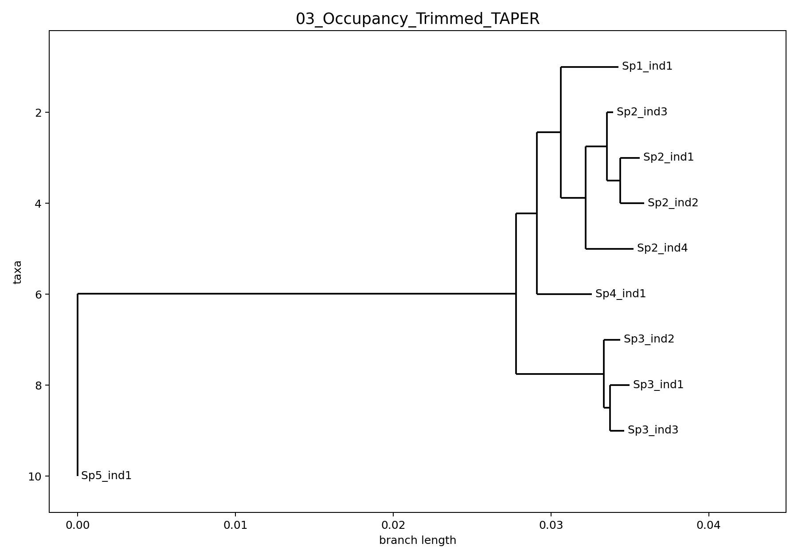
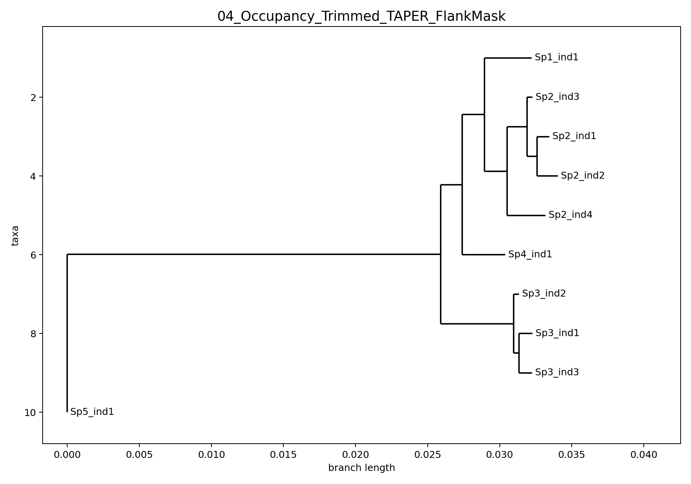

# alignment-cleanup

This repository packages a three-step cleanup workflow for locus-by-locus nucleotide alignments, using an anonymized 50-locus example dataset derived from unpublished exon alignments.

The workflow implemented here is:

1. `Occupancy Trim`: custom terminal trimming + short-fragment masking + locus dropping
2. `TAPER`: masking of likely erroneous local alignment regions
3. `Flank mask`: custom masking of terminal private mismatches / singleton edge junk

The example trees below are maximum-likelihood trees built after concatenating all 50 example loci at each step. `IQ-TREE` was used here with `GTR+G`; if `IQ-TREE` is unavailable, the helper script can fall back to `FastTree`.

## Why This Exists

The main motivation was practical alignment QC for shallow genomic comparisons where problematic terminal sites can inflate apparent autapomorphies and distort branch lengths. In the original Galeichthys use case, the goal was not to claim that one generic aligner-cleaner solved everything, but to show a transparent, parameterized sequence of decisions:

- first trim low-occupancy ends and mask tiny fragments
- then apply `TAPER`
- then explicitly clean residual flank-local singleton noise that `TAPER` may not target well

This repository is set up so those decisions are not hard-coded. Each step exposes thresholds that can be changed interactively or passed at the command line.

## Example Tree Progression

These figures use 50 anonymized loci included in this repository. Taxa were renamed to placeholders such as `Sp1_ind1`, `Sp2_ind3`, etc. so the example data can be shared publicly.

### 1. Non-Trimmed



### 2. Occupancy Trimmed



### 3. Occupancy Trimmed + TAPER (`-c 1.5`)



### 4. Occupancy Trimmed + TAPER + Flank Mask



## Full Local Run Summary

On the original local Galeichthys run that motivated this repo:

- `892` cleaned NT loci entered the custom trim step
- `732` loci were retained after the custom trim
- `160` loci were moved into `dropped_loci/`
- `TAPER` was run on the retained set using `-c 1.5`
- the final custom flank masker changed `540` of the `732` retained loci and masked `12,345` flank bases

The example data committed here is a public-facing subset of `50` loci sampled from the final retained set and then carried backward across all earlier pipeline stages for comparison.

## Repository Layout

```text
galeichthys-alignment-cleanup/
├── README.md
├── data/
│   └── examples/
│       ├── 01_Gene_Alignments_Non-Trimmed/
│       ├── 02_Gene_Alignments_TRIMMED_CODEX/
│       ├── 03_Gene_Alignments_TRIMMED_CODEX_TAPER/
│       ├── 04_Gene_Alignments_TRIMMED_CODEX_TAPER_FLANKMASK/
│       └── example_loci.txt
├── docs/
│   ├── figures/
│   └── trees/
└── scripts/
    ├── step1_trim.py
    ├── step3_flankmask.py
    ├── concatenate_alignments.py
    ├── draw_tree.py
    ├── prepare_example_dataset.py
    ├── build_example_trees.sh
    └── run_pipeline_interactive.sh
```

## Step 1: Custom Trim

Script: [`scripts/step1_trim.py`](scripts/step1_trim.py)

This step:

- trims left and right alignment edges until minimum occupancy is reached
- masks sequence fragments that are too short relative to the locus
- drops all-gap columns created by masking
- keeps retained loci in the main output folder
- moves low-occupancy loci to `dropped_loci/`

Thresholds are exposed instead of being hard-coded:

- minimum column occupancy can be set as either:
  - absolute taxon count with `--min-col-occupancy-taxa`
  - fraction of taxa with `--min-col-occupancy-frac`
- minimum retained taxa per locus can be set as either:
  - absolute taxon count with `--min-locus-taxa`
  - fraction of taxa with `--min-locus-frac`
- short-fragment masking uses:
  - `--min-fragment-bp`
  - `--min-fragment-frac`

Defaults currently shown in the script are pragmatic starting points, not recommendations that should always be accepted without question.

## Step 2: TAPER

Step 2 is run with [`TAPER`](https://github.com/chaoszhang/TAPER), which is credited to:

- Zhang, C., Zhao, Y., Braun, E. L., & Mirarab, S. (2021)
- GitHub: [chaoszhang/TAPER](https://github.com/chaoszhang/TAPER)
- Siavash Mirarab GitHub: [smirarab](https://github.com/smirarab)

In the example run documented here, `TAPER` was run with:

```bash
julia correction_multi.jl -l -m N -a N -c 1.5 taper_file_list.txt
```

The main exposed user decision here is the aggressiveness cutoff:

- `-c 3` is closer to the default behavior
- lower values such as `-c 2` or `-c 1.5` are more aggressive

## Step 3: Flank Mask

Script: [`scripts/step3_flankmask.py`](scripts/step3_flankmask.py)

This step was added because `TAPER` did not always target the exact problem seen in the original QC screenshots: terminal private mismatches and edge-local singleton noise that still looked like spurious autapomorphies in shallow trees.

For each sequence in each locus, the flank masker:

- scans from both ends
- asks whether a site is supported by more than one sequence in a sufficiently occupied column
- keeps masking until it reaches a run of consecutive "good" bases

Thresholds are exposed:

- minimum occupied taxa per column:
  - `--min-col-occupancy-taxa`
  - or `--min-col-occupancy-frac`
- required run length of non-singleton supported bases:
  - `--good-run`

## Interactive End-to-End Runner

Script: [`scripts/run_pipeline_interactive.sh`](scripts/run_pipeline_interactive.sh)

This wrapper asks the user for thresholds at each step instead of silently locking in the original Galeichthys values. It prompts for:

- Step 1:
  - column occupancy mode and threshold
  - locus retention mode and threshold
  - minimum fragment bp
  - minimum fragment fraction
- Step 2:
  - `TAPER` cutoff
- Step 3:
  - flank occupancy mode and threshold
  - required run length

Example usage:

```bash
./scripts/run_pipeline_interactive.sh /path/to/repo /path/to/input_alignments
```

## Rebuilding the Example Trees

The example tree workflow is:

1. prepare anonymized 50-locus example folders
2. concatenate all loci within each step
3. run ML tree inference
4. render tree PNGs for the README

To regenerate the trees:

```bash
./scripts/build_example_trees.sh /path/to/this/repo
```

By default, the script looks for:

- `IQ-TREE`: `/Applications/iqtree-2.4.0-macOS/iqtree2`
- `FastTree`: whatever `command -v FastTree` finds

If `IQ-TREE` is unavailable, it will fall back to `FastTree`.

## Notes on the Example Data

- The example loci are anonymized.
- The example taxa are anonymized.
- The example dataset is intentionally limited to `50` loci.
- The example folder names mirror the local QC progression rather than a formal publication nomenclature.
- This repository is designed to demonstrate the workflow and parameterization, not to publish the underlying unpublished biological dataset.

## Credits

- Custom trim and flank-mask scripting in this repository: local workflow packaging for the Galeichthys cleanup use case
- `TAPER`: [chaoszhang/TAPER](https://github.com/chaoszhang/TAPER)
- Siavash Mirarab GitHub: [smirarab](https://github.com/smirarab)
- ML example trees: `IQ-TREE` with `GTR+G`, with optional `FastTree` fallback
